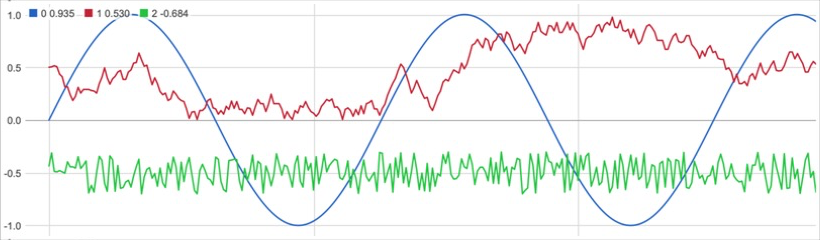

# idoi.plotter

> **Moved:** idoi.plotter is now part of [idoi.sensorkit](https://github.com/idoiidoi/idoi.sensorkit),
> a Max 9 package with idoi.calibrate, idoi.plotter, idoi.datarecorder and idoi.dataplayer.
> This repository is archived and no longer updated.
> In sensorkit the plotter's `background` attribute is `bgcolor` and `label` is `channelname`
> (v8ui boxes intercept those names).

A real-time multi-channel time series plotter for Max, built on `v8ui`.
Meant for watching streams from external sensors: send a list per frame and
each element becomes a line.



Requires **Max 9** or later (`v8ui`). The previous `jsui` version (Max 8) is
in the git history at tag `v1-jsui`.

## Install

Clone (or download) this repository into your Max packages folder and restart Max:

```bash
git clone https://github.com/idoiidoi/idoi.plotter.git ~/Documents/Max\ 9/Packages/idoi.plotter
```

Then create the object by typing into an object box:

```
v8ui @filename idoi.plotter.js
```

Option-click (Alt-click) it to open the help patch.

## Input

| Message | Effect |
| --- | --- |
| `list` | One frame. One value per channel: `0.2 0.5 -1.3` draws three lines. |
| `float` / `int` | One frame with a single channel. |

The number of channels may change while streaming. Missing values are drawn
as gaps instead of dropping to zero.

## Attributes

All attributes can be set in the inspector, as `@name value` in the object
box, or by sending `name value`. They are saved with the patcher.

| Attribute | Default | Description |
| --- | --- | --- |
| `samples` | 300 | Buffer length. The whole buffer spans the plot width, newest sample on the right. |
| `autoscale` | 1 | Fit the Y range to the visible data. |
| `ymin`, `ymax` | 0, 1 | Y range when `autoscale` is off. |
| `smooth` | 1 | Trailing moving average window in samples. 1 draws raw data. |
| `linewidth` | 1.5 | Line width in pixels. |
| `gridx` | 100 | Vertical grid line every N samples (0 = off). Lines scroll with the data. |
| `gridy` | 1 | Horizontal grid with Y labels. |
| `legend` | 1 | Channel names and latest values. |
| `names` | – | Channel names, e.g. `names accel_x accel_y accel_z`. |
| `colors` | – | Channel colors as `r g b r g b ...` (0–1). Unset channels get distinct default colors. |
| `background` | 1 1 1 1 | Background color (rgba). |
| `fps` | 30 | Maximum redraw rate. Input is never blocked by drawing. |

## Messages

| Message | Effect |
| --- | --- |
| `ybounds <min> <max>` | Set the Y range and turn `autoscale` off. |
| `setcolor <ch> <r> <g> <b>` | Color of one channel (channels start at 0). |
| `label <ch> <text>` | Name of one channel. |
| `pause [0/1]` | Freeze the display. Incoming data is dropped while paused. No argument toggles. |
| `clear` | Clear the data, keep the view settings. |
| `reset` | Clear the data and turn `autoscale` back on. |

The jsui-era messages `setColor`, `lineinterval`, `windowsize` and
`interpolation` still work.

## Output

When the view is changed by the mouse (and once on load), the outlet sends

```
autoscale <0/1>
ybounds <min> <max>
```

so other UI (toggles, number boxes, a second plotter) can follow.

## Mouse

| Gesture | Effect |
| --- | --- |
| Drag up / down | Zoom Y around the clicked value (Shift: fine). |
| Cmd/Ctrl + drag | Move the Y range. |
| Double click | Toggle `autoscale`. |

## Development

The drawing-independent code (ring buffer, moving average, ranges, ticks) is in
`javascript/idoi.plotter.core.js` and has unit tests that run in plain node:

```bash
node --test test/*.test.js
```

The help patch is generated by `tools/make_help.py`; edit that script instead
of the `.maxhelp` file and run `python3 tools/make_help.py`.

## License

MIT
